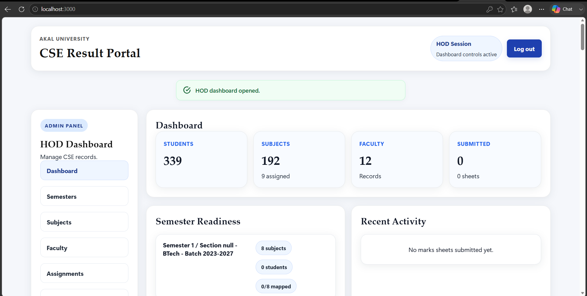
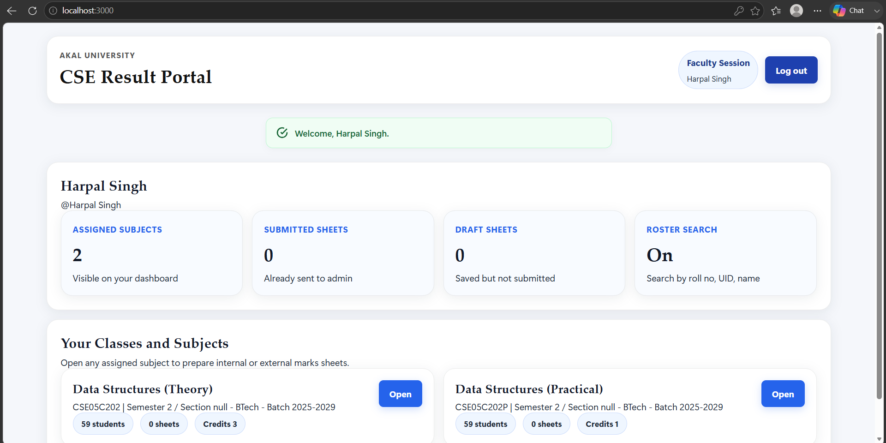
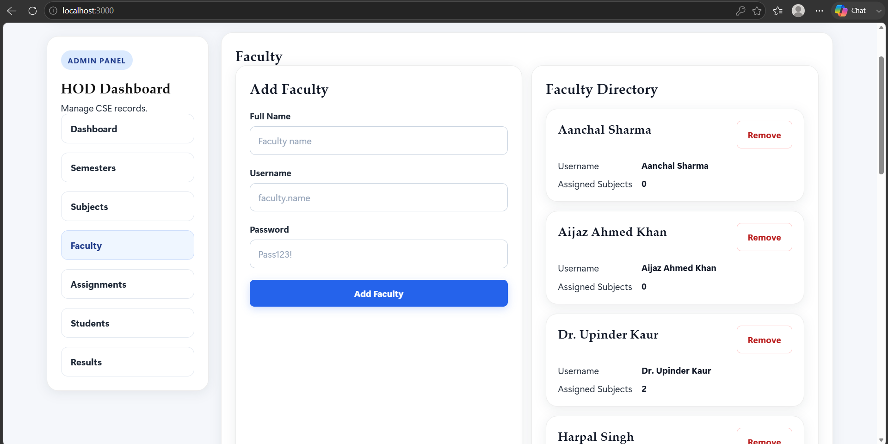
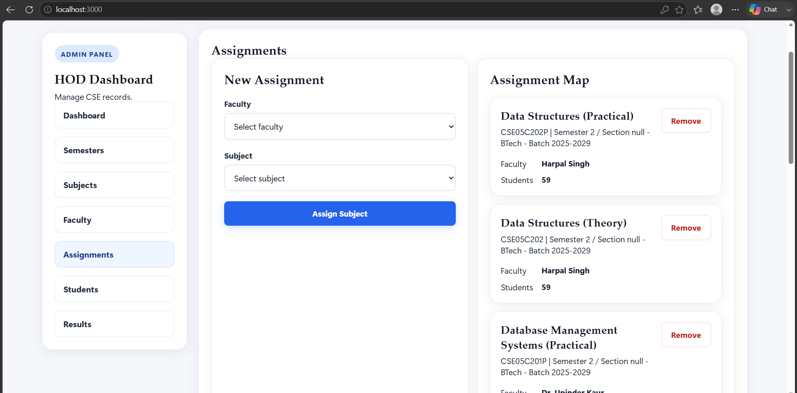
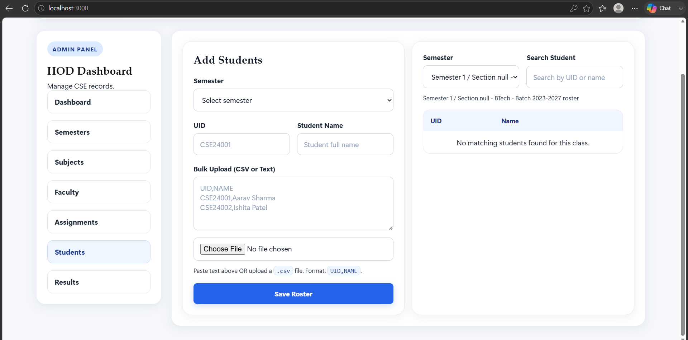
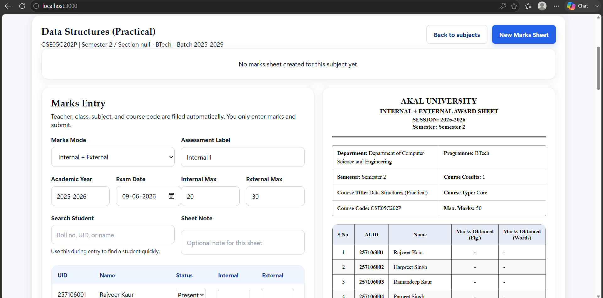
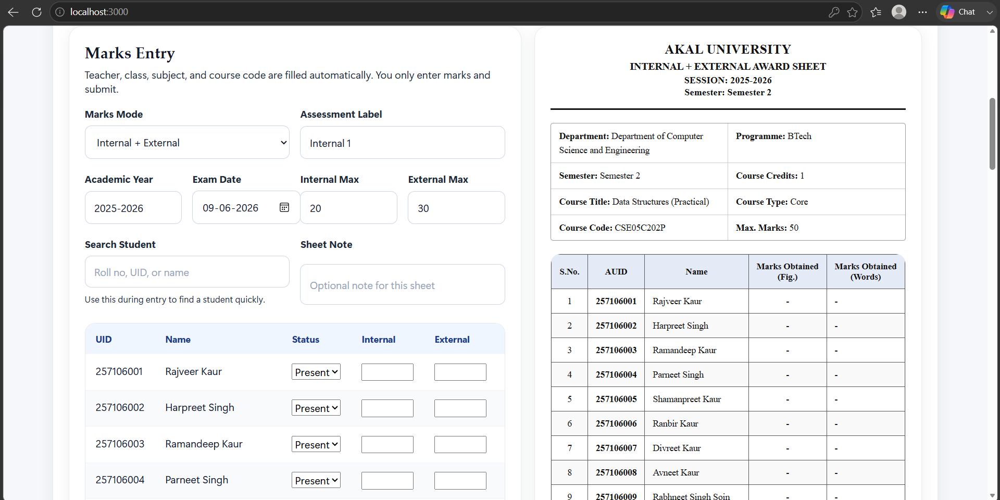
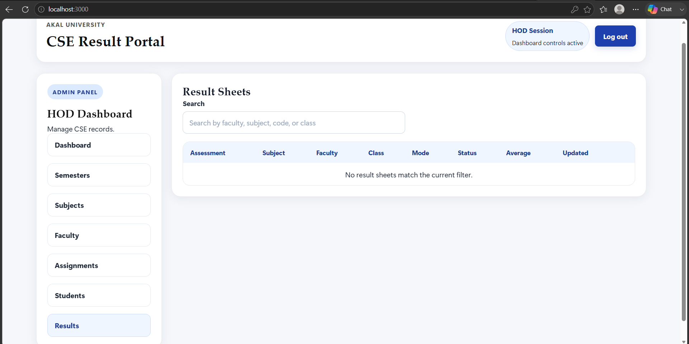

# Assessment Evaluation System

A web-based academic assessment management platform designed to streamline result processing and award sheet generation within educational institutions.

## Overview

The system provides separate portals for HODs and faculty members. HODs can manage students, subjects, semesters, and faculty assignments, while faculty members can securely enter marks for their assigned subjects and generate standardized result sheets.

The platform reduces manual paperwork, minimizes formatting errors, and ensures consistency in academic assessment records.

## Features

### HOD Module

* Add and manage students
* Add and manage faculty members
* Create subjects and semesters
* Assign subjects to faculty
* Review result sheets and academic records

### Faculty Module

* Secure authentication
* View assigned subjects and classes
* Search students by Roll Number, UID, or Name
* Enter internal and external assessment marks
* Generate standardized marksheets

### Result Management

* Automated total and grade calculation
* Centralized record storage
* Print-ready PDF generation
* Consistent marksheet formatting across departments

## Technology Stack

**Frontend**

* HTML
* CSS
* JavaScript

**Backend**

* Node.js
* Express.js

**Database**

* SQLite

**Authentication**

* OTP-based Faculty Login
* Session Management
* Role-Based Access Control (RBAC)

## Screenshots

### Login Page

(Add Screenshot)

### HOD Dashboard

(Add Screenshot)

### Faculty Dashboard

(Add Screenshot)

### Marks Entry Interface

(Add Screenshot)

### Generated Marksheet

(Add Screenshot)

## Installation

```bash
npm install
npm start
```

Open:

http://127.0.0.1:3000

## Future Enhancements

* Email notifications
* Student portal
* Excel import/export
* Result analytics dashboard
* Cloud deployment

## Screenshots

### Login Page


### HOD Dashboard


### Faculty Dashboard


### Adding Faculty


### Assigning Subjects


### Adding Students


### Generating Marksheet


### Assessment


### Results

